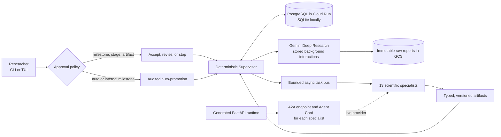

# Co-Scientist

Co-Scientist is a terminal-first system for developing scientific hypotheses,
research plans, critiques, and reproducible study protocols. A deterministic
Supervisor coordinates 13 purpose-specific agents and records every draft,
decision, and revision in an auditable research history.

It supports any of six broad research modes: experimental, observational,
computational, theory/simulation, systematic review, and measurement/field
research.

> Co-Scientist is a research-planning aid. It does not run experiments,
> validate scientific conclusions, or replace qualified ethics, safety,
> statistical, or domain review.

## Quick start

The default provider is deterministic and offline. It requires no cloud
credentials and is the simplest way to inspect the workflow. Because it cannot
perform or verify literature research, it stops at the Evidence integrity gate;
the researcher must explicitly choose the clearly labeled exploratory fallback
to continue.

```bash
export PATH="$PWD/.tools/bin:$PATH"
uv sync

# Interactive default: approve scope, shortlist, protocol, and dossier.
uv run coscientist tui \
  "Can a protective coating improve lithium-ion battery cycle life?"

# Auto mode accepts ordinary drafts, but never waives the Evidence gate.
uv run coscientist run \
  "Can a protective coating improve lithium-ion battery cycle life?" \
  --approval-profile auto
```

Add persistent state and a Markdown report:

```bash
uv run coscientist tui \
  "Can a protective coating improve lithium-ion battery cycle life?" \
  --db .coscientist/research.db \
  --save battery-session.json \
  --report battery-brief.md
```

The default export is a complete, enterprise-grade scientific research dossier featuring:

- **Executive Synthesis (Executive Summary)**: Powered by `DossierManifest` from the `meta_reviewer` agent, presenting top recommendations, unresolved fatal flaws, and specific evidence that would change the decision.
- **Evidence Discovery & Annotated Bibliography**: Displays a Discovery Metrics Banner, clickable links to standalone full-text Deep Research synthesis artifacts (`deep_research_synthesis_report.md` & `.pdf`), the complete embedded Deep Research scientific literature synthesis report, and a structured **Annotated Bibliography & Source Evidence Mapping Table** (`| # | Source Title & Clickable Link | Source Type | Core Finding & Methodological Relevance |`) with real scholarly paper titles and contextual summaries.
- **Complete Research Lineage**: Includes candidate ideas, evidence packets, five-axis independent reviews, 3-round Swiss/Elo tournament rankings, evolution rounds, proximity maps, decisions, tasks, checksums, and lineage.
- **Clickable ReportLab PDF & DOCX Exports**: ReportLab PDF exports feature native clickable Table of Contents bookmarks (`#anchors`), visual diagram boxes (`──▶`), zero HTML entities, and a two-pass **Index of Figures and Tables** with verified page numbers.

```bash
uv run coscientist run "Can a coating improve cycle life?" \
  --approval-profile auto \
  --report battery-dossier.pdf

uv run coscientist run "Can a coating improve cycle life?" \
  --approval-profile auto \
  --report battery-dossier.docx
```

## Choose how it runs

Approval and agent execution are separate choices:

| Choice | Option | Behavior |
| --- | --- | --- |
| Approval | `milestone` (default) | Pauses for scope, shortlist, validation protocol, and final dossier; bounded internal stages advance automatically. |
| Approval | `stage` | Pauses after every workflow stage for accept, revise, or stop. |
| Approval | `artifact` | Requires a decision for every specialist result before consolidating its stage. |
| Approval | `auto` | Accepts ordinary valid drafts automatically and records each decision as `auto_approval_policy`. |
| Approval | `--evidence-review` | Adds one stop on the evidence base itself, which no profile except `stage` and `artifact` otherwise pauses at. Ignored by `auto`. |
| Provider | `offline` (default) | Uses conservative deterministic templates. Ideal for demos, tests, and reviewing the workflow. |
| Provider | `a2a` | Calls live Gemini specialists through their A2A endpoints. Requires the local server and Google Cloud credentials. |

No profile waives missing-input, safety, ethics, privacy, or institutional
approval blocks. Auto approval only advances the planning workflow and never
authorizes real-world research.

## What happens during a session

New V2 sessions use eight review gates:

```text
scope
  → iterative Deep Research evidence discovery and source verification
  → candidate generation
  → five independent correctness, novelty, methods, impact, and governance reviews
  → three-round Swiss/Elo ranking, top-four round robin, and a closing briefing from the judge
  → shortlist evolution and mandatory re-review flag
  → proximity and diversity analysis
  → meta-review
  → full research dossier
```

Several agents can contribute to one gate. The full specialist team is:

| Specialist | Responsibility |
| --- | --- |
| Goal and triage | Scope the question, intended claim, constraints, and risks. |
| Evidence discovery | Run one to three stored Standard Deep Research passes, audit coverage, then target unresolved gaps with at most six Google Search queries. All results remain unverified leads. |
| Source verification | Inspect permitted original pages and distinguish verified sources from search leads. |
| Generation | Produce diverse, falsifiable candidate hypotheses or models. |
| Reflection | Challenge assumptions, causality, feasibility, and counter-explanations. |
| Novelty review | Compare every candidate with prior art and assess incrementalism. |
| Methods and statistics | Review measurement, controls, sampling, analysis, uncertainty, and replication. |
| Ethics, safety, and governance | Identify privacy, biosafety, dual-use, data-rights, and approval requirements. |
| Impact review | Review information gain, importance, feasibility, cost, time, and external validity. |
| Ranking | Compare candidates using evidence, feasibility, impact, risk, and uncertainty. |
| Evolution | Refine promising candidates into testable protocols and falsifiers. |
| Proximity and diversity | Detect duplicates, blind spots, and underexplored alternatives. |
| Meta-review | Audit the complete record and issue a conditional recommendation. |

Each specialist completion creates a validated typed draft. Only the Supervisor
can accept it into the canonical session and advance to the next gate.

## Architecture



The deployable ADK entry point is [`app/agent.py`](app/agent.py). The
code-enforced workflow and approval state machine live in
[`coscientist/orchestration.py`](coscientist/orchestration.py). SQLite stores
sessions, A2A tasks, decisions, lineage, and audit events.

## Human-in-the-loop usage

Start an interactive session:

```bash
uv run coscientist tui \
  "Can a protective coating improve lithium-ion battery cycle life?"
```

The default milestone profile displays four ordinary Supervisor milestones,
plus the Evidence integrity gate whenever discovery or claim-level verification
is incomplete. Select another profile when you want finer or coarser control:

```bash
# Review all eight V2 stages.
uv run coscientist tui "Can a coating improve cycle life?" \
  --approval-profile stage

# Review every specialist result.
uv run coscientist tui "Can a coating improve cycle life?" \
  --approval-profile artifact
```

Evidence is not one of the milestones: discovery runs as internal work and the
first thing the profile hands back is the hypotheses built on it. Add one stop
on the corpus itself — what was found, what survived verification, and which
facets nothing covers — before the generators reason over it:

```bash
uv run coscientist tui "Can a coating improve cycle life?" \
  --evidence-review
```

The web launcher ticks the same box by default; `--auto` ignores it, having
nobody to ask. It is set once for a new run and kept for the run's whole life.

Revising at that gate does not start discovery again. What you write in the box
becomes one search, each gap the coverage audit named becomes another, up to six
in total, and they run as grounded web searches against the corpus that already
exists — no second Deep Research wave, nothing already found discarded, and the
coverage audit re-scored over the merged result. A revision that has to leave
gaps unsearched says so in the manifest rather than dropping them quietly.

Each displayed gate contains the relevant specialist outputs:

```text
STAGE: REFLECT  |  SUPERVISOR BUNDLE: 3 SPECIALIST TASK(S)
------------------------------------------------------------------------
...

[a]ccept, [e]dit/revise, [s]top:
```

- `a` accepts the current draft and advances.
- `e` requests a revision. Your feedback is recorded and the same gate runs
  again as a new artifact version.
- `s` stops the session while preserving accepted work.

## Auto-approval usage

Use auto mode for unattended demonstrations and evaluation:

```bash
uv run coscientist run \
  "Can a coating improve cycle life?" \
  --auto \
  --save demo-session.json \
  --report demo-brief.md
```

`--auto` is an alias for `--approval-profile auto`.

Auto mode deliberately stops with status `evidence_required` when Deep Research
is unavailable, fails, or Source Verification cannot attach exact locations to
material claims. In the web UI or TUI, choose retry or explicitly continue as
exploratory. The exploratory choice is audited and every downstream result
remains a proposal, not an evidence-backed finding.

## Evidence discovery and grounding

V2 uses this sequential knowledge-building loop:

```text
accepted ResearchPlan
  → Deep Research pass 1 (broad landscape)
  → citation-constrained normalization
  → direction/facet coverage audit
  → optional focused pass 2
  → optional pass 3 only after measurable pass-2 improvement
  → narrow Google Search enrichment for residual gaps
  → Source Verification against original material
  → Generation
```

Every Deep Research report and citation payload is immutable and provenance is
preserved across passes. The report’s Evidence section presents research
directions, readable source titles and links, coverage, disagreements, and
unresolved gaps. Internal source and candidate IDs are confined to technical
provenance instead of being used as end-user labels.

Deep Research uses the Gemini Interactions API with
`deep-research-preview-04-2026`, `background=true`, and `store=true`. The
normalizer remains `gemini-3.1-pro-preview` on Vertex AI’s `global` endpoint,
with high thinking and no tools. Google Search is available only to targeted
evidence enrichment, and `load_web_page` is available only to Source
Verification. No Model Armor component is used.

## Missing scientific inputs

Co-Scientist blocks claims that depend on data it has not received. For example,
exact peptide fragmentation requires a sequence, and scRNA-seq cluster or
trajectory claims require a dataset file or public accession.

Provide the requested input:

```bash
uv run coscientist run \
  "Analyze scRNA-seq data for PD-1 resistance" \
  --approval-profile auto \
  --input single_cell_dataset=GSE123456
```

Or explicitly choose a literature-only synthesis. The dossier will state that
no sequence or dataset was analyzed:

```bash
uv run coscientist run \
  "Design fragmentation for a hydrophobic 45-mer peptide" \
  --approval-profile auto \
  --literature-only \
  --report peptide-literature-dossier.md
```

## Save and resume

### Resume from JSON

```bash
uv run coscientist tui \
  --resume battery-session.json \
  --save battery-session.json \
  --report battery-brief.md
```

### Resume from SQLite

The CLI prints the session ID after each run:

```bash
uv run coscientist tui \
  --db .coscientist/research.db \
  --session-id session_1234...
```

SQLite persistence includes optimistic locking, so an older process cannot
silently overwrite a newer session version.

## Select a scientific method

Co-Scientist classifies the question automatically. Override the classification
when necessary:

```bash
uv run coscientist tui \
  "Assess the evidence for intervention X" \
  --research-mode systematic_review
```

Accepted values:

- `experimental`
- `observational`
- `computational`
- `theory_simulation`
- `systematic_review`
- `measurement_field`

Each mode adds its own method checklist. For example, computational work
requires provenance, leakage controls, baselines, ablations, and reproducible
environments, while observational work requires confounder analysis,
missing-data handling, privacy review, and limits on causal claims.

## Run with live Gemini agents

Live mode uses Vertex AI with:

- `gemini-3.1-pro-preview`
- the `global` endpoint
- high thinking depth
- Google Search only on the Evidence Discovery specialist
- page loading only on the Source Verification specialist

### 1. Authenticate

```bash
export GOOGLE_CLOUD_PROJECT="your-project-id"
gcloud auth application-default login
```

The application sets `GOOGLE_GENAI_USE_VERTEXAI=TRUE` and
`GOOGLE_CLOUD_LOCATION=global`. The global endpoint does not provide an
in-region data-processing guarantee.

### 2. Start the generated ADK/A2A server

In one terminal:

```bash
export PATH="$PWD/.tools/bin:$PATH"
uv run uvicorn app.fast_api_app:app --host 127.0.0.1 --port 8000
```

### 3. Run the Supervisor through A2A

In another terminal:

```bash
# Live human-in-the-loop
uv run coscientist tui \
  "Design a reproducible battery study" \
  --provider a2a \
  --a2a-url http://127.0.0.1:8000

# Live auto approval; this can make several billable model calls.
uv run coscientist run \
  "Design a reproducible battery study" \
  --provider a2a \
  --approval-profile auto \
  --a2a-url http://127.0.0.1:8000
```

For a quick direct smoke test of the ADK agent:

```bash
agents-cli run "Describe the scientific stages you support"
```

## Access the deployed service

The public research workspace is available at:

<https://coscientist-r2vgs5vdkq-ue.a.run.app>

### Web human-in-the-loop controls

Choose **Guided HITL** above the web composer, then select an approval cadence:

- **Milestones** pauses at scope, ranking, evolution, and meta-review. Internal
  stages are automatically promoted and still recorded in the ledger.
- **Every stage** requires accept, revise, or stop after each stage.
- **Every artifact** requires approval of each specialist result before its
  Supervisor bundle can advance.
- **Auto** records automatic promotions but cannot waive input, governance,
  safety, ethics, privacy, or institutional-approval blocks.

At a human gate, the web UI displays the persisted stage and artifact version,
completed task count, missing-input actions, and four controls that name what
they act on: **Accept the &lt;draft&gt; & run &lt;next stage&gt;**, **Edit the
&lt;draft&gt; myself**, **Send the &lt;draft&gt; back for revision**, and **Stop
this session**. A line above them states what accepting will spend — accepting
the research plan starts a billed Deep Research wave — and, when the primary is
disabled, names every reason it is blocked instead of leaving it dead.
Initial framing, accepting, agent-requested revision, auto mode, and later-stage
generation all return immediately while a progress card tracks background
specialist work. A direct edit or agent revision creates a new artifact
version; every decision records its actor and automatic/manual status.
**Conversation** remains available for direct ADK chat without stage-promotion
controls.

After the Meta-review is accepted, the web UI displays a **Research workflow
complete** panel. The complete dossier can be downloaded as an editable DOCX
for opening in Google Docs, as a PDF, or as Markdown. The public service does
not request Google Drive OAuth or create documents inside a user's Drive.

The same unauthenticated service exposes ADK access:

```bash
agents-cli run \
  --url https://coscientist-r2vgs5vdkq-ue.a.run.app \
  --mode adk \
  "Describe the scientific stages you support"
```

And A2A access:

```bash
agents-cli run \
  --url https://coscientist-r2vgs5vdkq-ue.a.run.app \
  --mode a2a \
  "Create a literature-only research plan for my question"
```

Local development uses SQLite. A Cloud Run deployment becomes durable when
`CLOUD_SQL_CONNECTION_NAME`, `DATABASE_NAME`, `SESSION_DATABASE_NAME`,
`DATABASE_USER`, and the
Secret-Manager-backed `DATABASE_PASSWORD` are configured. The governed
research ledger, audit decisions, background-operation leases, ADK sessions,
and A2A tasks then use PostgreSQL; `LOGS_BUCKET_NAME` enables GCS-backed ADK
artifacts. Session discovery remains private to the browser and no global
session-list endpoint is exposed.

Each newly created guided session includes a one-time deletion credential that
is kept only in that browser. The history menu distinguishes removing a local
browser reference from permanently deleting the cloud session. Because
`allUsers` has the Cloud Run invoker role, anonymous use can consume Cloud Run
and Vertex AI quota.

Run the complete offline browser check before deployment:

```bash
node tests/e2e/web_hitl_flow.mjs
```

It starts a deterministic local server and headless Chromium, revises and
accepts a full milestone workflow, checks stable polling and structured stage
cards, verifies browser/cloud deletion behavior and desktop/mobile scrolling,
and writes a screenshot to `/tmp/coscientist-hitl-e2e.png`.

The safety-governance card has its own check, because the offline provider never
writes a fatal flaw and that path would otherwise only ever run in production:

```bash
node tests/e2e/web_governance_card.mjs
```

It seeds a session halted on three fatal findings, then answers them one at a
time in the browser and holds that each settles in place on the same card —
carrying its verdict, adjudicator and reason — while the reasons typed into the
findings that are still open survive untouched.

## A2A endpoints

| Endpoint | Purpose |
| --- | --- |
| `/a2a/app` | Supervisor-facing A2A JSON-RPC endpoint. |
| `/a2a/app/.well-known/agent-card.json` | Supervisor Agent Card. |
| `/a2a/specialists/<name>` | JSON-RPC endpoint for one specialist. |
| `/a2a/specialists/<name>/.well-known/agent-card.json` | Specialist Agent Card. |

ADK sessions and A2A tasks use the durable database under `.coscientist/`
unless service URIs are explicitly overridden.

## Developer tools

The repository includes project-local `uv`, Node.js/`npx`, agents-cli, and Git
under `.tools`:

```bash
export PATH="$PWD/.tools/bin:$PATH"
uv --version
git --version
agents-cli --version
```

## Verify the project

Check deterministic code and contracts:

```bash
agents-cli lint
uv run pytest tests/unit tests/integration
```

Evaluate live agent behavior:

```bash
agents-cli eval generate \
  --dataset tests/eval/datasets/basic-dataset.json

agents-cli eval grade \
  --config tests/eval/eval_config.yaml
```

The larger cross-domain set is
[`tests/eval/datasets/cross-domain-dataset.json`](tests/eval/datasets/cross-domain-dataset.json).

Credential-dependent integration tests are opt-in because they call Vertex AI:

```bash
COSCIENTIST_LIVE_TESTS=true uv run pytest \
  tests/integration/test_server_e2e.py::test_a2a_chat_stream
```

## Project map

| Path | Purpose |
| --- | --- |
| [`app/agent.py`](app/agent.py) | Gemini model configuration and live specialist tree. |
| [`app/fast_api_app.py`](app/fast_api_app.py) | Generated ADK and A2A server. |
| [`coscientist/orchestration.py`](coscientist/orchestration.py) | Supervisor, approval policies, and stage transitions. |
| [`coscientist/models.py`](coscientist/models.py) | Typed contracts for sessions, tasks, artifacts, evidence, and decisions. |
| [`coscientist/ledger.py`](coscientist/ledger.py) | Durable SQLite persistence and optimistic locking. |
| [`coscientist/methods.py`](coscientist/methods.py) | Scientific-method adapters. |
| [`docs/improvement-plan.md`](docs/improvement-plan.md) | Architecture rationale and remaining pre-deployment work. |

## Safety and research integrity

Search results are discovery leads until the original source is inspected.
Generated hypotheses are proposals, not findings. Co-Scientist never performs
laboratory, clinical, field, or safety-critical actions. Qualified humans remain
responsible for source validation, methodology, statistics, ethics, safety,
research conduct, and conclusions.
